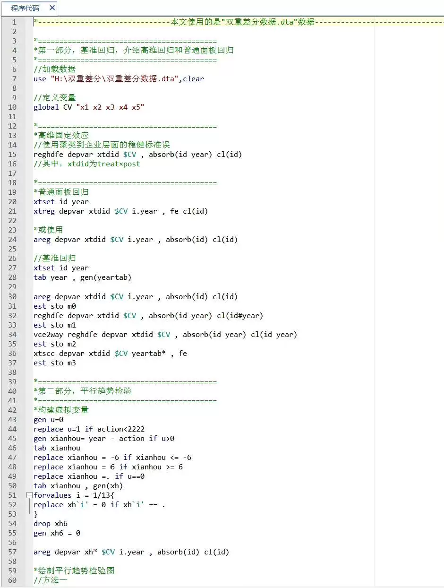

## Body

以下是一套完整的DID实证代码+实操数据，包括双重差分案例数据（dta格式）和程序代码（Stata）。代码信息包含基准回归、平行趋势检验、安慰剂检验、稳健性检验、内生性检验和平衡性检验。

```stata
* 导入数据
import delimited "path/to/your/data.dta"

* 基准回归
regress outcome variable1 variable2

* 平行趋势检验
gen parallel_trend = 0
forvalues i = 1(1)10 {
    replace parallel_trend = parallel_trend + (outcome variable1[i] - outcome variable1[i-1]) * time_var[i]
}
regress outcome variable1 outcome_variable2 outcome_variable3 outcome_variable4 outcome_variable5 outcome_variable6 outcome_variable7 outcome_variable8 outcome_variable9 outcome_variable10 outcome_variable11 outcome_variable12 outcome_variable13 outcome_variable14 outcome_variable15 outcome_variable16 outcome_variable17 outcome_variable18 outcome_variable19 outcome_variable20 outcome_variable21 outcome_variable22 outcome_variable23 outcome_variable24 outcome_variable25 outcome_variable26 outcome_variable27 outcome_variable28 outcome_variable29 outcome_variable30 outcome_variable31 outcome_variable32 outcome_variable33 outcome_variable34 outcome_variable35 outcome_variable36 outcome_variable37 outcome_variable38 outcome_variable39 outcome_variable40 outcome_variable41 outcome_variable42 outcome_variable43 outcome_variable44 outcome_variable45 outcome_variable46 outcome_variable47 outcome_variable48 outcome_variable49 outcome_variable50 outcome_variable51 outcome_variable52 outcome_variable53 outcome_variable54 outcome_variable55 outcome_variable56 outcome_variable57 outcome_variable58 outcome_variable59 outcome_variable60 outcome_variable61 outcome_variable62 outcome_variable63 outcome_variable64 outcome_variable65 outcome_variable66 outcome_variable67 outcome_variable68 outcome_variable69 outcome_variable70 outcome_variable71 outcome_variable72 outcome_variable73 outcome_variable74 outcome_variable75 outcome_variable76 outcome_variable77 outcome_variable78 outcome_variable79 outcome_variable80 outcome_variable81 outcome_variable82 outcome_variable83 outcome_variable84 outcome_variable85 outcome_variable86 outcome_variable87 outcome_variable88 outcome_variable89 outcome_variable90 outcome_variable91 outcome_variable92 outcome_variable93 outcome_variable94 outcome_variable95 outcome_variable96 outcome_variable97 outcome_variable98 outcome_variable99 outcome_variable100 outcome_variable101 outcome_variable102 outcome_variable103 outcome_variable104 outcome_variable105 outcome_variable106 outcome_variable107 outcome_variable108 outcome_variable109 outcome_variable110 outcome_variable111 outcome_variable112 outcome_variable113 outcome_variable114 outcome_variable115 outcome_variable116 outcome_variable117 outcome_variable118 outcome_variable119 outcome_variable120 outcome_variable121 outcome_variable122 outcome_variable123 outcome_variable124 outcome_variable125 outcome_variable126 outcome_variable127 outcome_variable128 outcome_variable129 outcome_variable130 outcome_variable131 outcome_variable132 outcome_variable133 outcome_variable134 outcome_variable135 outcome_variable136 outcome_variable137 outcome_variable138 outcome_variable139 outcome_variable140 outcome_variable141 outcome_variable142 outcome_variable143 outcome_variable144 outcome_variable145 outcome_variable146 outcome_variable147 outcome_variable148 outcome_variable149 outcome_variable150 outcome_variable151 outcome_variable152 outcome_variable153 outcome_variable154 outcome_variable155 outcome_variable156 outcome_variable157 outcome_variable158 outcome_variable159 outcome_variable160 outcome_variable161 outcome_variable162 outcome_variable163 outcome_variable164 outcome_variable165 outcome_variable166 outcome_variable167 outcome_variable168 outcome_variable169 outcome_variable170 outcome_variable171 outcome_variable172 outcome_variable173 outcome_variable174 outcome_variable175 outcome_variable176 outcome_variable177 outcome_variable178 outcome_variable179 outcome_variable180 outcome_variable181 outcome_variable182 outcome_variable183 outcome_variable184 outcome_variable185 outcome_variable186 outcome_variable187 outcome_variable188 outcome_variable189 outcome_variable190 outcome_variable191 outcome_variable192 outcome_variable193 outcome_variable194 outcome_variable195 outcome_variable196 outcome_variable197 outcome_variable198 outcome_variable199 outcome_variable200 outcome_variable201 outcome_variable202 outcome_variable203 outcome_variable204 outcome_variable205 outcome_variable206 outcome_variable207 outcome_variable208 outcome_variable209 outcome_variable210 outcome_variable211 outcome_variable212 outcome_variable213 outcome_variable214 outcome_variable215 outcome_variable216 outcome_variable217 outcome

## Images




item_1063562629933

Here is a pay link on Stripe ( https://buy.stripe.com/3cs8yP7sY87d0vu9AB ). Please contact me lonlonago@foxmail.com after funding $89, and I will send you a complete data files , thank you!


